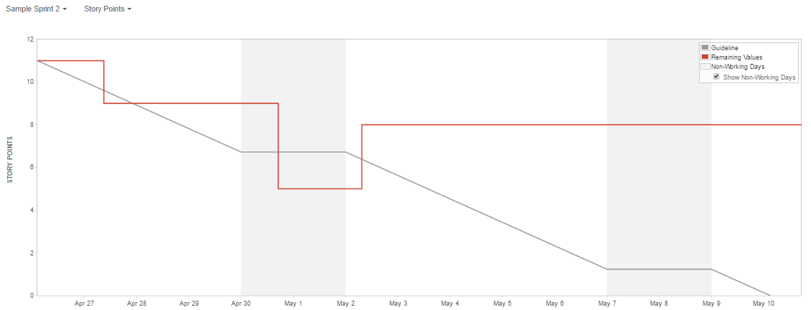
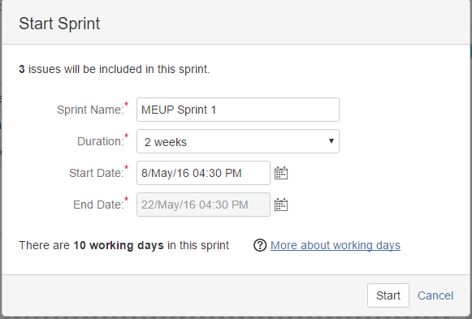

Primeiros passos da jornada ágil com o Scrum

Sobre este documento
====================

Este documento não tem por objetivo ser um guia definitivo ou mesmo uma bíblia de conhecimentos sobre metodologias ágeis, Scrum ou mesmo um modelo a ser obrigatoriamente seguido por todos que desejem implantar o Scrum como método de trabalho dentro do grupo Santander. O objetivo deste documento é ser uma referência adaptável e constantemente atualizada por qualquer funcionário de grupo os primeiros passos para implementação de uma metodologia ágil utilizando as ferramentas do Serenity ALM dentro do grupo Santander.

Caso você não esteja familiarizado com o Serenity ALM recomendamos a leitura deste link:

https://github.com/ProdubanBR/ALM-SerenityBR

Motivação e um pouco de teoria 
===============================

As metodologias ágeis começaram a ser criadas e difundidas no final dos anos 80 com o nome de métodos “leves” em contraposição aos métodos “pesados” como *Unified Software Development Process*, OPEN e SSADM. E tem ganhado muita popularidade devido ao seu ganho de velocidade na **entrega de valor ao cliente**.

Além disso algumas das principais características dos métodos ágeis são: Entregas incrementais, cooperativada entre a equipe e o cliente, foco na produção de artefatos com valor ao cliente e adaptativos ao seu ambiente.

Com a sua popularização em 2001 alguns dos principais autores de métodos ágeis e outros autores renomados da área de engenharia de software publicaram o Manifesto Ágil.

O manifesto contém os princípios do desenvolvimento de software ágeis, e os chamados métodos ágeis como Scrum, XP, FDD e outros seguem estes princípios fundamentais.

“**Indivíduos e interação entre eles** mais que processos e ferramentas **software em funcionamento** mais que documentação abrangente **colaboração com o cliente** mais que negociação de contratos **responder a mudanças** mais que seguir um plano”

O método Scrum que foi criado por Ken Schwaber em 1995 e revisado por Ken Schwaber, Jeff Sutherland e outros em 2001 é um dos métodos ágeis mais difundidos e utilizados e possui uma série de ferramentas e utilitários para apoiá-los dentre elas o JIRA com o Plug-in Agile.

O Scrum é um método, frequentemente definido pelos seus praticantes como Framework, que tem o seu foco nas atividades de gestão e planejamento de atividades deixando aberto para os desenvolvedores escolherem as técnicas e práticas para a implementação. Ele foi desenvolvido para ambientes voláteis e de forma empírica baseada na flexibilidade, adaptabilidade e

Produtividade.

Scrum
=====

Scrum(substantivo): Um *framework* dentro do qual pessoas podem tratar e resolver problemas complexos e adaptativos, enquanto produtiva e criativamente entregam produtos com o mais alto valor possível. Scrum é:

-   Leve

-   Simples de entender

-   Extremamente difícil de dominar

Papeis e reponsabilidades
-------------------------

O Time Scrum é composto pelo Product Owner, o Time de Desenvolvimento e o Scrum Master. Times Scrum são auto-organizáveis e multifuncionais.

Times Scrum entregam produtos de forma iterativa e incremental, maximizando as oportunidades de realimentação. Entregas incrementais de produto “Pronto” garantem que uma versão potencialmente funcional do produto do trabalho esteja sempre disponível.

### Product Owner

Product Owner, ou dono do produto, é o responsável por maximizar o valor do produto e do trabalho do Time de Desenvolvimento.

Responsabilidades:

-   Expressar claramente os itens do Backlog do Produto;

-   Ordenar os itens do Backlog do Produto para alcançar melhor as metas e missões;

-   Garantir o valor do trabalho realizado pelo Time de Desenvolvimento;

-   Garantir que o Backlog do Produto seja visível, transparente, claro para todos, e mostrar o que o Time Scrum vai trabalhar a seguir; e,

-   Garantir que o Time de Desenvolvimento entenda os itens do Backlog do Produto no nível necessário

### O Time de desenvolvimento

O Time de Desenvolvimento consiste de profissionais que realizam o trabalho de entregar uma versão usável que potencialmente incrementa o produto “Pronto” ao final de cada Sprint.

Responsabilidades:

-   Eles são auto-organizados. Ninguém (nem mesmo o Scrum Master) diz ao Time de

Desenvolvimento como transformar o Backlog do Produto em incrementos de funcionalidades potencialmente utilizáveis;

-   Times de Desenvolvimento são multifuncionais, possuindo todas as habilidades necessárias, enquanto equipe, para criar o incremento do Produto.

-   O Scrum não reconhece títulos para os integrantes do Time de Desenvolvimento que não seja o Desenvolvedor, independentemente do trabalho que está sendo realizado pela pessoa; não há exceções para esta regra.

-   Individualmente os integrantes do Time de Desenvolvimento podem ter habilidades especializadas e área de especialização, mas a responsabilidade pertence ao Time de Desenvolvimento como um todo; e,

-   Times de Desenvolvimento não contém sub-times dedicados a domínios específicos de conhecimento, tais como teste ou análise de negócios.

### Scrum Master

O Scrum Master é responsável por garantir que o Scrum seja entendido e aplicado. O Scrum Master ajuda aqueles que estão fora do Time Scrum a entender quais as suas interações com o Time Scrum são úteis e quais não são. O Scrum Master ajuda todos a mudarem estas interações para maximizar o valor criado pelo Time Scrum.

Reponsabilidades, com o Product Owner:

-   Encontrando técnicas para o gerenciamento efetivo do Backlog do Produto;

-   Claramente comunicar a visão, objetivo e itens do Backlog do Produto para o Time de

-   Desenvolvimento;

-   Ensinar a Time Scrum a criar itens de Backlog do Produto de forma clara e concisa;

-   Compreender a longo-prazo o planejamento do Produto no ambiente empírico;

-   Compreender e praticar a agilidade; e,

-   Facilitar os eventos Scrum conforme exigidos ou necessários

Reponsabilidades, com o Time de desenvolvimento:

-   Treinar o Time de Desenvolvimento em autogerenciamento e interdisciplinaridade;

-   Ensinar e liderar o Time de Desenvolvimento na criação de produtos de alto valor;

-   Remover impedimentos para o progresso do Time de Desenvolvimento;

-   Facilitar os eventos Scrum conforme exigidos ou necessários; e,

-   Treinar o Time de Desenvolvimento em ambientes organizacionais nos quais o Scrum não é totalmente adotado e compreendido.

Reponsabilidades, com a organização:

-   Liderando e treinando a organização na adoção do Scrum;

-   Planejando implementações Scrum dentro da organização;

-   Ajudando funcionários e partes interessadas a compreender e tornar aplicável o Scrum e o desenvolvimento de produto empírico;

-   Causando mudanças que aumentam a produtividade do Time Scrum; e,

-   Trabalhando com outros Scrum Masters para aumentar a eficácia da aplicação do Scrum nas organizações.

Rituais do Scrum
----------------

Eventos prescritos são usados no Scrum para criar uma rotina e minimizar a necessidade de reuniões não definidas no Scrum. Todos os eventos são eventos time-boxed, de tal modo que todo evento tem uma duração máxima.

### Sprint

O coração do Scrum é a Sprint, um time-boxed de um mês ou menos, durante o qual um “Pronto”, versão incremental potencialmente utilizável do produto, é criado. Sprints tem durações coerentes em todo o esforço de desenvolvimento. Uma nova Sprint inicia imediatamente após a conclusão da Sprint anterior.

As Sprints são compostas por uma reunião de planejamento da Sprint, reuniões diárias, o trabalho de desenvolvimento, uma revisão da Sprint e a retrospectiva da Sprint.

Durante a Sprint:

-   Não são feitas mudanças que possam pôr em perigo o objetivo da Sprint;

-   As metas de qualidade não diminuem; e,

-   O escopo pode ser clarificado e renegociado entre o Product Owner e o Time de Desenvolvimento quanto mais for aprendido.

### Reunião de Planejamento da Sprint 

O trabalho a ser realizado na Sprint é planejado na reunião de planejamento da Sprint. Este plano é criado com o trabalho colaborativo de todo o Time Scrum.

A reunião de planejamento da Sprint responde as seguintes questões:

-   O que pode ser entregue como resultado do incremento da próxima Sprint?

-   Como o trabalho necessário para entregar o incremento será realizado?

### Reunião diária

A Reunião Diária do Scrum é um evento time-boxed de 15 minutos, para que o Time de

Desenvolvimento possa sincronizar as atividades e criar um plano para as próximas 24 horas.

-   Durante a reunião os membros do Time de Desenvolvimento esclarecem:

-   O que eu fiz ontem que ajudou o Time de Desenvolvimento a atender a meta da Sprint?

-   O que eu farei hoje para ajudar o Time de Desenvolvimento atender a meta da Sprint?

-   Eu vejo algum obstáculo que impeça a mim ou o Time de Desenvolvimento no atendimento da meta da Sprint?

### Revisão da Sprint

A Revisão da Sprint é executada no final da Sprint para inspecionar o incremento e adaptar o Backlog do Produto se necessário. Durante a reunião de Revisão da Sprint o Time Scrum e as partes interessadas colaboram sobre o que foi feito na Sprint.

A Reunião de Revisão inclui os seguintes elementos:

-   Os participantes incluem o Time Scrum e os Stakeholders chaves convidados pelo Product Owner;

-   O Product Owner esclarece quais itens do Backlog do Produto foram “Prontos” e quais não foram “Prontos”;

-   O Time de Desenvolvimento discute o que foi bem durante a Sprint, quais problemas ocorreram dentro da Sprint, e como estes problemas foram resolvidos;

-   O Time de Desenvolvimento demonstra o trabalho que está “Pronto” e responde as questões sobre o incremento;

-   O Product Owner discute o Backlog do Produto tal como está. Ele (ou ela) projeta as prováveis datas de conclusão baseado no progresso até a data (se necessário);

-   O grupo todo colabora sobre o que fazer a seguir, e é assim que a Reunião de Revisão da Sprint fornece valiosas entradas para a Reunião de Planejamento da próxima Sprint;

-   Análise de como o mercado ou o uso potencial do produto pode ter mudado e o que é a coisa mais importante a se fazer a seguir; e,

-   Análise da linha do tempo, orçamento, potenciais capacidades, e mercado para a próxima versão esperada do produto.

### Retrospectiva da Sprint

A Retrospectiva da Sprint é uma oportunidade para o Time Scrum inspecionar a si próprio e criar um plano para melhorias a serem aplicadas na próxima Sprint.

O propósito da Retrospectiva da Sprint é:

-   Inspecionar como a última Sprint foi em relação às pessoas, aos relacionamentos, aos processos e às ferramentas;

-   Identificar e ordenar os principais itens que foram bem e as potenciais melhorias; e,

-   Criar um plano para implementar melhorias no modo que o Time Scrum faz seu trabalho;

Definição de “pronto”
---------------------

Quando o item do Backlog do Produto ou um incremento é descrito como “Pronto”, todos devem entender o que o “Pronto” significa. Embora, isso varie significativamente de um extremo ao outro para cada Time Scrum, os integrantes devem ter um entendimento compartilhado do que significa o trabalho estar completo, assegurando a transparência. Esta é a “Definição de Pronto” para o Time Scrum e é usado para assegurar quando o trabalho está completado no incremento do produto.

Prática com Jira
================

No Serenity ALM a ferramenta eleita para suportar o processo de criação dos Backlogs, definição de Sprints, acompanhamento de tarefas e relatórios é o JIRA.

O primeiro passo para gestão das tarefas a criação de um projeto no Jira.

Neste documento vamos abordar o fluxo de criação e manutenção do Jira como administrador da ferramenta, lembrando que dentro do Serenity ALM nem todos possuíram este acesso. Porém, caso você queira saber como funciona o fluxo de solicitação dentro do Serenity ALM basta seguir o fluxo de Onboard descrito no documento <https://github.com/ProdubanBR/ALM-SerenityBR>.

Criando um projeto
------------------

Para criar um projeto no basta acessar o Jira e efetuar o Login, no menu irá conter a opção “Projects” e selecionar “Create Project”

Como pode-se verificar o JIRA permite a criação e o gerenciamento de diversos tipos de projeto de Negócio ou de Software, utilizando Scrum ou outro método ágil ou não.

Neste exemplo iremos criar um novo projeto utilizando o método Scrum.

Por padrão ao se criar um projeto com Scrum no Jira ele irá predefinir os tipos de tarefas (Issue Types) e um Workflow padrão, que podem ser modificados depois.

A estrutura padrão de tarefas no Jira é:

E o Workflow padrão:

Após escolher o método de trabalho você deve escolher o nome do projeto (que deve ter no máximo 80 caracteres), a chave (que pode ser gerada automaticamente a partir do Nome) e o Líder do Projeto.

O líder do projeto é um papel fundamental no Jira, pois ele terá a permissão de realizar configurações no projeto como por exemplo adicionar novos membros no time.

Configurando o seu projeto
--------------------------

Antes de iniciar o cadastro dos itens no backlog do projeto é interessante verificar se os tipos de tarefa e o workflow atual atende a necessidade de seu processo.

Dentro do grupo Santander além dos tipos de tarefa apontados (Epic, Story, Task, Bug e Sub-Task) também é utilizado o conceito de “Feature”.

Para a criação deste novo tipo de issue acesse “Project settings” &gt; “Issue Types”

Selecione “Actions”&gt; “Edit Issue Types”&gt; “Add issue type”

E crie o novo tipo “Feature”

Tipos de tarefa no Jira
-----------------------

Abaixo estão descritos uma sugestão de uso destas atividades.

**Epic**: Épicos são ‘corpos de trabalho’ que agrupam uma série de histórias de usuário e uma série de ‘Features’, que representam uma funcionalidade em nível de negócio.

Exemplos:

-   Todo o recurso de gerenciamento de conta;

-   Toda a funcionalidade de verificar o histórico de compras.

**Feature**: São funcionalidades do sistema em nível de negócio e agrupam várias histórias de usuários (assim como os épicos). Diferentes dos épicos as Features/Funcionalides representam alguma funcionalidade especifica sistêmica dentro de um grupo de funcionalidades de negócio

Exemplos:

-   Editar as informações do usuário

-   Buscar uma compra anterior

**Story**: São histórias de usuário, originadas pela especificação do método ágil XP.

User Stories são **escritos pelos clientes** como coisas que o sistema precisa fazer por eles. Eles são semelhantes aos ‘use cases’, exceto que não se limitam a descrever a interface de usuário. Eles estão no formato de cerca de três frases do texto escritos pelo cliente na terminologia clientes sem citar a tecnologia.

User Stories também conduzem a criação dos testes de aceitação. É recomendado criar um ou mais testes de aceitação automatizados para verificar se história do usuário foi implementado corretamente.

É recomendado criar as histórias com a seguinte sintaxe

> “As a &lt;type of user&gt;, I want &lt;goal&gt; so that I &lt;receive benefit&gt;”
>
> “Como um &lt;tipo de usuário&gt;, eu quero &lt;objetivo&gt; para que eu &lt;benefício recebido&gt;”

Exemplo:

-   Como um cliente de conta corrente, eu quero verificar o meu saldo para que eu saiba o quanto eu tenho para gastar.

**Task:** São as tarefas em nível de desenvolvimento necessárias para que seja possível o desenvolvimento de uma **Story**. Elas devem ser significantes para o time de desenvolvimento, mas com informações suficientes para que o Scrum Master e o P.O. tenham a compreensão do que está sendo desenvolvido.

Exemplo:

-   Criar a tabela no banco de dados para armazenar os dados do usuário

-   Desenvolver o front-end para desenvolver a tela de edição dos dados de usuário

**Sub-Task:** São sub passos, bem atómicos, sobre o que deve ser feito dentro de uma tarefa. Este tipo de ‘issue’ não é obrigatório para todas as tarefas.

Exemplo:

-   Criação da camada de acesso ao banco para consulta da tabela de clientes

-   Edição do campo de email para o dado do usuário

**Bug:** São tarefas que representam erros do sistema que devem ser corrigidos para o time de desenvolvimento.

Exemplo:

-   Erro ao cadastrar usuários com aspas no nome. Preconceito com Joana D’ark.

Gestão de Backlog
-----------------

O próximo passo é criar o backlog contendo as atividades do seu projeto na tela de backlog, basta selecionar o tipo de “issue” e escrever as atividades para serem adicionadas no backlog.

Importante, a responsabilidade de escrever o backlog é do P.O. com o suporte do Scrum Master.

Após criar algumas tarefas e adiciona-las no backlog podemos criar uma Sprint para execução destas tarefas.

Mas antes de criar a Sprint é recomendável estimar as tarefas utilizando a técnica de planning poker (veja: <https://en.wikipedia.org/wiki/Planning_poker>) ou técnicas de estimativas similares.

A utilização da estimativa vai permitir o cálculo da velocidade de entrega dos times, dando uma visão de pontos por Sprint.

Para criar uma Sprint basta clicar no botão “create a Sprint” e arrastar e soltar as tarefas a serem adicionadas em cada Sprint e clicar em “Start Sprint”.

Após a configuração das datas de início e fim da Sprint, podemos inicia-la.

Kanban
------

O Kanban é uma técnica relacionada ao método Just-in-Time, desenvolvida e aperfeiçoada em 1940 por Taiichi Ohno e Sakichi Toyoda conhecida como Sistema Toyota de Produção. Ele tem como objetivo indicar o andamento do fluxo de produção de modo visual.

Dessa maneira qualquer pessoa que olhe o kanban pode facilmente identificar o que cada pessoa está executando no projeto e o seu andamento.

Dentro do Jira o Kanban associa uma série de atividades e por padrão traz as seguintes colunas: To Do, In Progress e Done.

Para atender os passos específicos de cada projeto o fluxo de trabalho, pode ser customizado.

Para isso basta clicar na opção de “Board” &gt; “Configure”&gt; “Columns” e “Add Collumn”

Observe que existem outras configurações no Jira como a opção “Days in Collumn” que exibe os dias que cada tarefa está em cada coluna e a opção de “Column Constraint” que permite limitar o número de tarefas por coluna.

E outras opções que permitem agrupas os cards, definir a cor por tipos customizados, definir o tipo de estimativa entre outros.

Uso das tarefas
---------------

Após a atribuição das tarefas da Sprint para cada membro do time é recomendada o uso das colunas de cada atividade para acompanhamento. Por exemplo: atualização do status das tarefas nos comentários, definição de prioridade, definição do Epic, definição de tarefas ligadas (uma tarefa dependente de outra) dentre outros.

Adicionar usuários
==================

Para adicionar um novo usuário no Jira é necessário ter as devidas permissões e clicar em “selecionar membros para o time”

Configuração de Workflow
========================

Para configurar um fluxo de trabalho customizado é necessário possuir as devidas permissões de admistração. Acessar “Issues”&gt; “Workflow”. Neste local te dará a visão atual do workflow que está sendo utilizado pelo projeto.

Atenção: o workflow utilizado pelo seu projeto pode ser compartilhado com outros projetos, por isso cuidado ao alterar.

Observe que o Workflow do Jira tem 2 tipos de componentes:

1.  Status

Assim como o próprio nome diz são status da atividade, normalmente associados a uma coluna no Kanban.

1.  Transition

São restrições de transições de status entre as tarefas, permitindo a passagem de um status para outro.

Como exemplo vamos criar um novo Status, “Shadown Deploy” que só pode ser transferido de “wait P.O. action”

Para isso primeiramente crie o novo status em “add status”

Após isso selecione a opção de “add transition”

Obs:. Adicionar transições só é permitido em workflows inativos.

Referencias
===========

\[1\] New Directions on Agile Methods: A Comparative Analysis. Abrahamsson, Pekka et. al

\[2\] The Impact of Organizational Culture on Agile Method Use. Strode, Diane et. al.

\[3\] <http://agilemanifesto.org/principles.html>

\[4\] <http://www.scrumguides.org/>

\[6\] <https://kenschwaber.wordpress.com/>

\[7\] <http://www.scrumguides.org/docs/scrumguide/v1/Scrum-Guide-Portuguese-BR.pdf>

\[8\] <https://www.atlassian.com/agile/delivery-vehicles>

\[9\] <http://www.extremeprogramming.org/rules/userstories.html>
