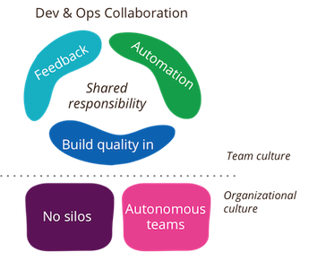

# DevOps na Produban com Serenity ALM

Sobre o documento
=================

O objetivo deste documento é oferecer uma visão inicial de como é o processo de DevOps na Produban e oferecer-se a ser um guia dos primeiros passos.

Importante notar que as ferramentas e processos de ALM, DevOps e Microserviços estão em constante atualização além de que o próprio processo da Produban está em amadurecimento constante por isso é esperado que alguns passos e referencias deste documento precisem de revisão e sinta-se livre para faze-lás ou entrar em contato com a equipe do Serenity ALM Brasil para tirar qualquer dúvida.

Motivação e Teoria
==================

ALM, DevOps e Microserviços são termos “novos” no mundo da tecnologia e propõe uma série de benefícios.

Antes de entrarmos na definição destes termos é importante notar que eles foram construídos tendo como base as metodologias ágeis, como SCRUM, XP e Feature Driven Development.

O termo metodologia ágil começou a ser falado em meados de 1980, mas formalmente surgiram após a assinatura e divulgação do manifesto ágil.

O manifesto que foi publicado em 2001, define alguns princípios para serem utilizados no processo de desenvolvimento de software em contraposição aos princípios divulgados pelas chamadas metodologias “tradicionais”, segue abaixo um trecho do manifesto:

“**Indivíduos e interação entre eles** mais que processos e ferramentas

**Software em funcionamento** mais que documentação abrangente

**Colaboração com o cliente** mais que negociação de contratos

**Responder a mudanças** mais que seguir um plano”\[2\]

Além disso outro ponto do manifesto incentiva a entrega de software funcionando com frequência “na escala de semanas até meses, com preferência aos períodos mais curtos”. O que incentiva a busca de ferramentas e processos de Entrega Continua.

Segundo Martin Fowler, a entrega continua (ContinuousDelivery - CD) é uma **disciplina** de desenvolvimento de software na qual possibilita a construção do software de uma maneira que ele possa ser disponibilizado em produção a qualquer momento.

E que você só está fazendo CD quando:

-   Seu software pode ser implantado em todo o seu ciclo de vida

-   Sua equipe tem como prioridade manter o software empregável mais do que trabalhar em novas funcionalidades

-   Qualquer pessoa pode obter feedback rápido e automatizado sobre a disponibilidade de seus sistemas em produção qualquer vez que alguém faz uma mudança nele

-   Você pode executar implantações por um botão sobre de qualquer versão do software a qualquer ambiente sob demanda

Para proporcionar a entrega continua algumas ferramentas e processos são necessários para auxiliar o time a manter um pipeline de entregas. Para manter um pipeline de entregas normalmente temos ferramentas de automatização de testes, builds e acompanhamento do status dos mesmos integradas com a ferramentas de controle de versão, ainda neste documento está descrito quais são estas ferramentas no caso do Serenity ALM.

Os benefícios deste processo são:

1.  Redução do Risco: desde que as entregas são pequenas mudanças já previamente testadas, os problemas são menos frequentes e simples de serem contornados.

2.  Processo confiável: As pessoas acompanham o trabalho pelo que considerado “Feito”. Neste processo o considerado “Feito” é algo em produção, mais do que “alguém declarou que está feito”.

3.  Feedback dos usuários: Entregas mais frequentes significam que o usuário está acompanhando e validando o que foi feito com mais frequência e no caso de algo não estar de acordo com o desejo do usuário o feedback é mais rápido devido aos ciclos curtos.

Este processo de entrega continua tem ligação estrita com o que podemos chamar de DevOps.

A ThoughtWorks define DevOps como o movimento **cultural** de quebra de silos entre os times de desenvolvimento e operação, em adição a quebra de silos propostas pelos métodos ágeis que já quebram os silos entre os times de requisitos, testes e desenvolvimento\[1\].

Logo quando falamos em DevOps, falamos da junção dos times de Operação e Desenvolvimento pela colaboração, nos quais os times dividem a responsabilidade ganhando agilidade sobre os modelos “com silo”.

ALM é a sigla para “Application lifecycle management” que são as aplicações que permitem a gestão do processo de desenvolvimento de software, e que consequentemente, suportam os processos ágeis e de entrega continua na empresa.

A arquitetura Microserviços é uma abordagem arquitetural que constitui no desenvolvimento de uma única aplicação como uma série de pequenos serviços cada um executando o seu próprio processo e comunicação por mecanismos leves, normalmente utilizando arquitetura RESTful.

O nome **micro**services dá a indicação de tamanho, a Amazon definiu que está associado a noção de que os serviços devem ser pequenos o suficiente para as equipes que os mantem terem no máximo 12 pessoas que é o máximo para que elas dividam duas pizzas, essa noção de tamanho ficou conhecida como “Pizza Team”.

Objetivo
========

Na Produban\\Santander os benefícios destes novos meios de trabalho são visíveis, principalmente devido à falta de ferramentas que possibilitem a entrega continua e suporte de maneira satisfatória o modelo ágil.

Para responder está necessidade foi criado o projeto “Serenity ALM”.

O Serenity ALM é um projeto que tem por objetivo entregar as ferramentas necessárias para o uso dos processos de DevOps e Entrega continua além de proporcionar uma consultoria de processo necessária para auxiliar os times a entenderem e utilizarem as peças.

Dentro da rede GSNET pode ser acessado o link <http://mediawiki.ci.gsnet.corp/w/index.php/Main_Page> no qual temos mais definições e explicações sobre o Serenity ALM.

Algumas das peças que atualmente estão comtempladas pelo Serenity ALM são:

-   JIRA: Ferramenta para controle de tarefas e atividades, proporciona um quadro Kanban de atividades.

-   Gitlab: Ferramenta integrada com o GIT que é responsável por ser o repositório de código fonte e seu gerenciamento de acessos.

-   Nexus: Gestão de bibliotecas e módulos de código fonte.

-   Sonar: Ferramenta de análise estática de código

-   Jenkins: Ferramenta de integração continua.

A imagem abaixo ilustra quais ferramentas são utilizadas em qual parte do processo de desenvolvimento.

Como começar:
=============

Se você se interessou pelo Serenity ALM e gostaria de usa-ló os primeiros passos para utiliza-ló são:

1.  Acesso a rede do banco com um Login\\Sigla de rede, caso você não tenha acesso será necessário solicita-ló pois todas as ferramentas estão hospedadas na Espanha e acessíveis pela rede GSNET e não por rede pública.

2.  Solicitação da criação dos usuários e projetos pelo processo de “Onboarding” via chamado no Jira da Espanha.

3.  Configuração das ferramentas:

    1.  JIRA

        1.  Criação e configuração de um board de tarefas

    2.  Gitlab

        1.  Versionamento do código em um novo reposotório

    3.  Jenkins

        1.  Definição dos JOBs de build, test e deploy

    4.  Sonar

        1.  Definição das regras de análise de código a serem apicaçadas

    5.  Nexus

        1.  Upload e configuração dos artefatos e dependencias

Onboarding
==========

O processo de Onboarding foi criado pela equipe do Serenity ALM da Espanha e tem como objetivo oferecer um fluxo único para os usuários solicitarem o acesso de forma padronizada e condizentes com as normas de auditoria do banco.

O link em inglês detalhado do processo de onboarding é:

<http://mediawiki.ci.gsnet.corp/w/index.php/Onboarding>

Antes de solicitar o acesso verifique se você tem acesso verifique com a Governança os critérios de pagamento aplicáveis e se a sua área tem a permissão necessária para utilizar e um “BILLING PRODUCT OWNER/ENTITY” válido.

Com está informação abra um novo ticket no JIRA para o grupo “Serenity ALM Support”

Acesso o Link <https://jira.ci.gsnet.corp/browse/CIGENTASKS/> e clique em “Create Issue”

Verifique se o Projeto selecionado é “ALM Serenity Support” e no campo “Reporter” coloque “alm-op” caso você ainda não tenha usuário criado.

De qualquer maneira anexe a planilha com as informações os usuários que terão acesso:

[download da planilha](TemplateALM.xlsx)

Campos do Projeto:

“Project Key”: coloque o nome do projeto no JIRA (no máximo 10 caracteres com letras em caixa alta

“BILLING PRODUCT OWNER/ENTITY”: Nome complete e ID do usuário reponsável pelo pagamento.

Campos dos usuários:

“User ID”: ID único do usuário, caso este usuário seja do grupo Santander preencher com a sigla de rede exemplo x110244 ou n120321. Caso seja externo, escolher um nome referente a empresa na qual ele representa (5 caracteres no máximo) e um número sequencial de 3 digitos. Ex: ibm001

“Mail”: o Email do usuário, deve ser único

“Name”: Nome do usuário

“Surname”: Último sobrenome do usuário

“CI Role”:Se referem ao papel desempenhado pelos usuários no Jenkins, GitLab, Nexus, Sonar e Openshift.

> Developers (de 0 até N)
>
> Product Owner (aconselhável de 1 até N)
>
> Technical Lead (De 1 até 3, obrigatório)

“ALM Role”: Se referem ao papel desempenhado pelo usuário no JIRA e no Confluence.

> Developers (de 0 até N)
>
> Product Owner (de 1 até N)
>
> Product Specialist (De 0 até N)
>
> Scrum Master (0 para times não Scrum ou 1 para times Scrum)
>
> Technical Lead (De 1 até N, obrigatório)

“Team”: O nome\\sigla referente ao time dos usuários

“Documentation”: Selecione Mediwiki, as licenças do Confluence não estão disponíveis

“Jira+Agile: Selecione SIM para acesso ao JIRA

“Tools”: Selecione SIM para acesso ao JIRA

“Openshift”: Selecione SIM se você irá utilizar o OpenShift, mas caso necessário é preciso abrir um novo chamado para a criação do projeto no OpenShift <https://gitlab.ci.gsnet.corp/openshift-v3/documentation/blob/master/OSEv3_quick_start.md>

Primeiro projeto
================

Com o acesso concedido e o primeiro usuário criado você terá as permissões necessárias para criar as tarefas (Issues) do seu projeto e criar a sua primeira Sprint. Além de configurar os quadros Kanban.

Referencias
===========

\[1\] <http://martinfowler.com/bliki/DevOpsCulture.html>

\[2\] <http://www.manifestoagil.com.br/>

\[3\] <http://martinfowler.com/bliki/ContinuousDelivery.html>

\[4\] <http://dl.acm.org/citation.cfm?id=103275>
